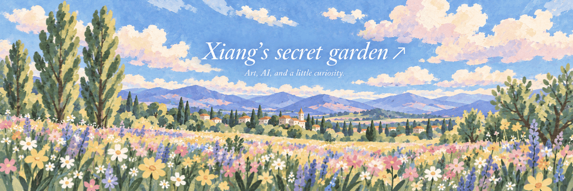
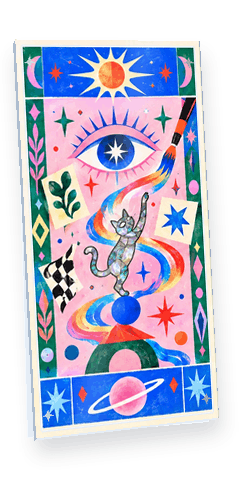
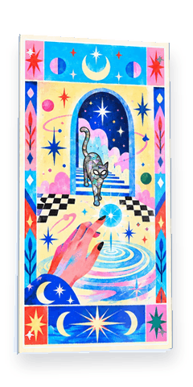
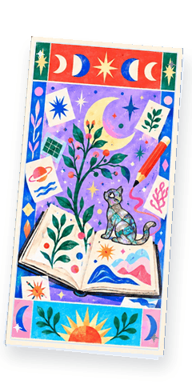
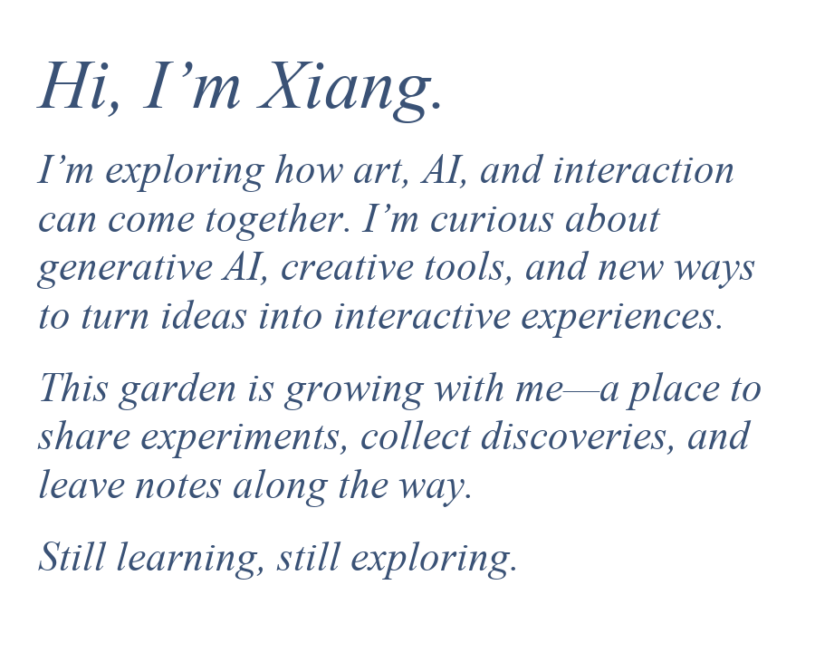
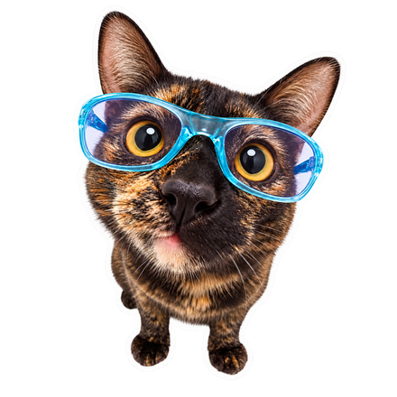

  <a href="https://github.com/wangxiangchaosheng-wq/wangxiangchaosheng-wq/blob/main/explorations/visual.md"><picture><source media="(prefers-reduced-motion: reduce)" srcset="assets/exploration-cards/visual.webp" /><source media="(prefers-color-scheme: dark)" srcset="assets/exploration-cards/visual-auto-dark.gif" /></picture></a>
  &nbsp;
  <a href="https://github.com/wangxiangchaosheng-wq/wangxiangchaosheng-wq/blob/main/explorations/interaction.md"><picture><source media="(prefers-reduced-motion: reduce)" srcset="assets/exploration-cards/interaction.webp" /><source media="(prefers-color-scheme: dark)" srcset="assets/exploration-cards/interaction-auto-dark.gif" /></picture></a>
  &nbsp;
  <a href="https://github.com/wangxiangchaosheng-wq/wangxiangchaosheng-wq/blob/main/explorations/learning.md"><picture><source media="(prefers-reduced-motion: reduce)" srcset="assets/exploration-cards/learning.webp" /><source media="(prefers-color-scheme: dark)" srcset="assets/exploration-cards/learning-auto-dark.gif" /></picture></a>
  &nbsp;&nbsp;
  <picture>
    <source media="(prefers-color-scheme: dark)" srcset="assets/intro-serif-ai-dark.png" />
    
  </picture>

---

<h3 align="center">Profile Views</h3>

  
  &nbsp;&nbsp;
  

  Counting visits since October 1, 2026.
   
  Powered by <a href="https://github.com/journey-ad/Moe-Counter">Moe-Counter</a>

