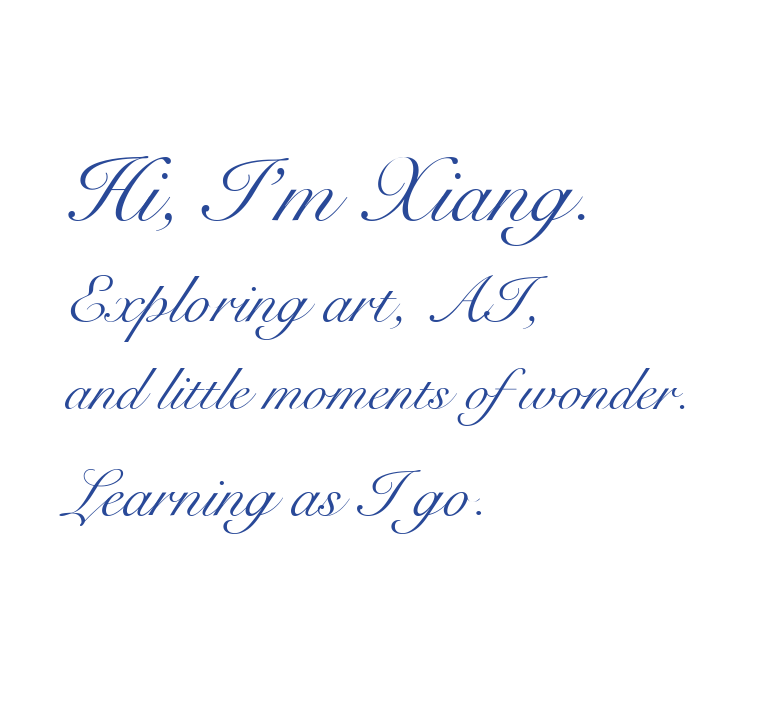

  
  &nbsp;
  
  &nbsp;
  
  &nbsp;&nbsp;
  <picture>
    <source media="(prefers-color-scheme: dark)" srcset="assets/intro-script-dark.png" />
    
  </picture>

---

<h3 align="center">Profile Views</h3>

  
  &nbsp;&nbsp;
  

  Counting visits since October 1, 2026.
   
  Powered by <a href="https://github.com/journey-ad/Moe-Counter">Moe-Counter</a>

