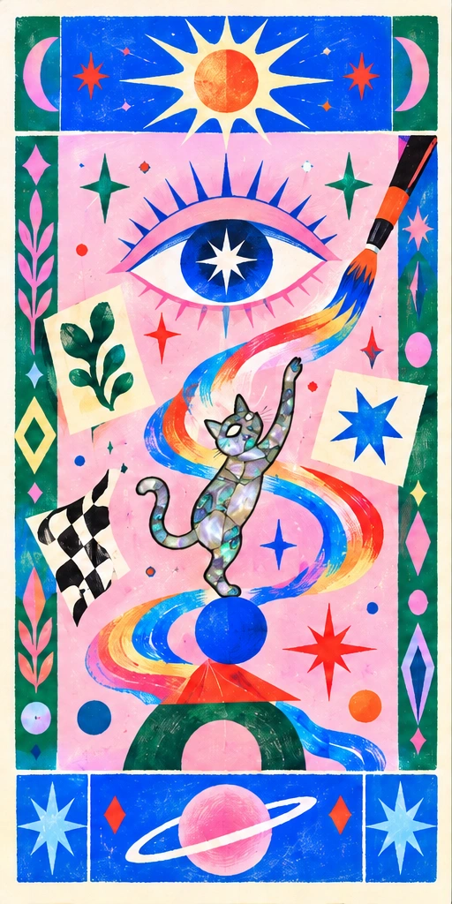
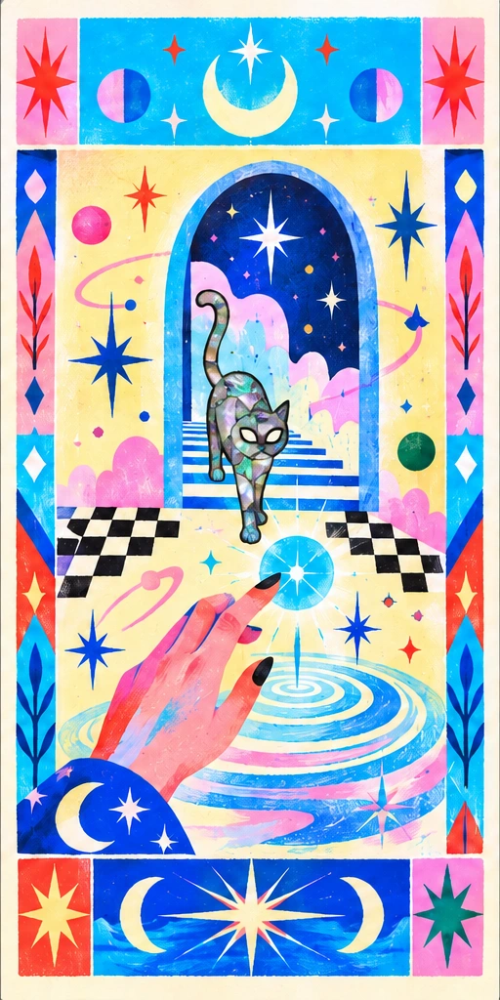
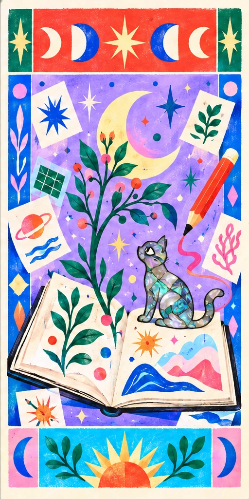

  <a href="https://xiang-secret-garden.netlify.app/"><em>Step into the garden ↗</em></a>

  
  &nbsp;
  
  &nbsp;
  

---

<h3 align="center">Profile Views</h3>

  
  &nbsp;&nbsp;
  

  Counting visits since October 1, 2026.
   
  Powered by <a href="https://github.com/journey-ad/Moe-Counter">Moe-Counter</a>

